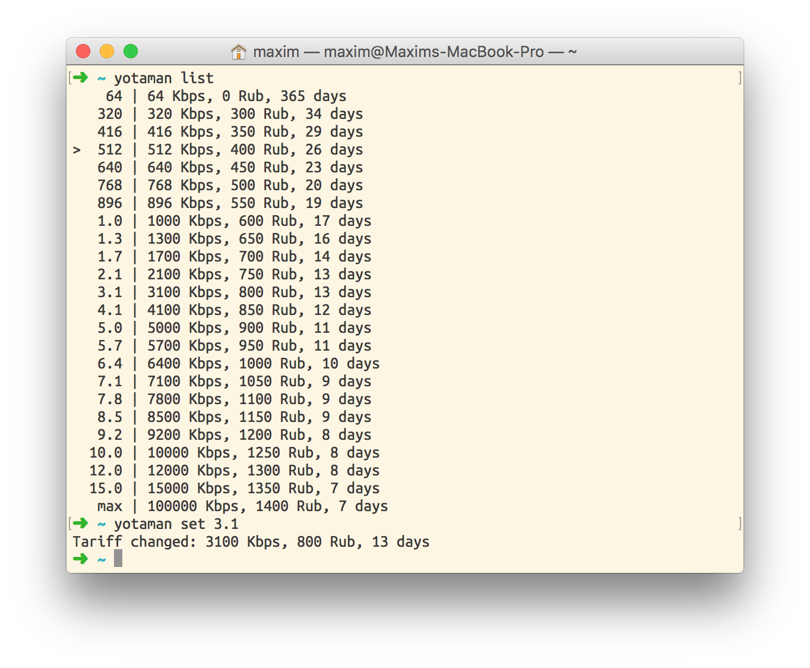

# YotaMan

This is console client for https://my.yota.ru. It show listing of available tariffs and may change speed. What for? Well... you can create schedule in cron: high speed during day and low at night. That's save you money :)

